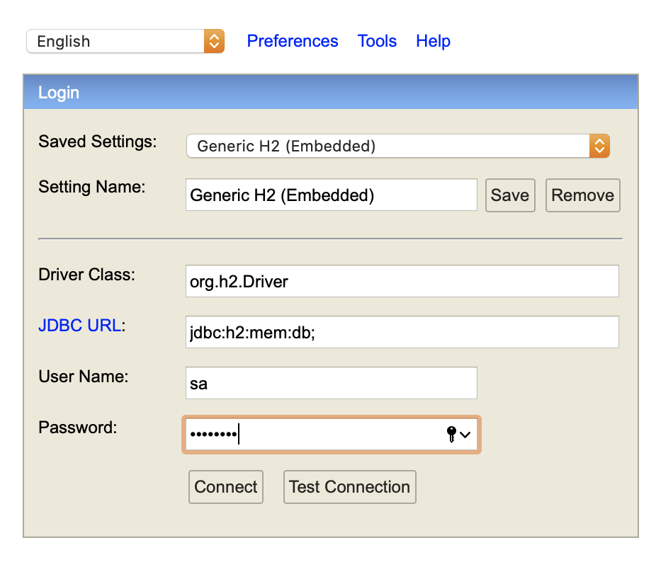
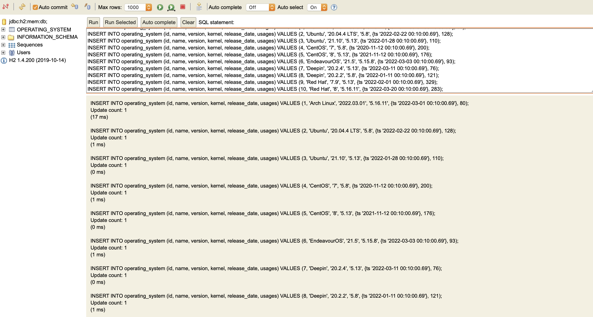

# Searching And Filtering Using JPA Specification

### Introduction


Spring data JPA provides many ways to deal with entities including query methods and custom JPQL queries. However, sometimes we need a more programmatic approach: for example Criteria API or QueryDSL.

Spring Data JPA Specification provides a convenient and sophisticated manner to build dynamic SQL where clauses. By adding some extra logic and considering some pitfalls, we are capable of offering API consumers a zero-effort generic mechanism for filtering entities.

Specification are built on top of the Criteria API to simplify the developer experience. When building a Criteria query we are required to build and manage `Root`, `Criteria Query` and `Criteria Builder` object by ourselves.

### Project Setup and Dependency

I'm depending [Spring Initializr](https://start.spring.io/) for this as it is much easier.

We need `spring-boot-starter-data-jpa`, `spring-boot-starter-web`, `lombok` and `h2database`. There is my `pom.xml`.

```xml
<dependency>
  <groupId>org.springframework.boot</groupId>
  <artifactId>spring-boot-starter-data-jpa</artifactId>
</dependency>
<dependency>
  <groupId>org.springframework.boot</groupId>
  <artifactId>spring-boot-starter-web</artifactId>
</dependency>
<dependency>
  <groupId>com.h2database</groupId>
  <artifactId>h2</artifactId>
  <scope>runtime</scope>
</dependency>
<dependency>
  <groupId>org.projectlombok</groupId>
  <artifactId>lombok</artifactId>
  <optional>true</optional>
</dependency>
<dependency>
  <groupId>org.springframework.boot</groupId>
  <artifactId>spring-boot-starter-test</artifactId>
  <scope>test</scope>
</dependency>
```

Add configuration `application.properties` file like following below.

```sh
server.port=8080
spring.application.name=search-request
server.servlet.context-path=/api

spring.datasource.url=jdbc:h2:mem:db;
spring.datasource.driverClassName=org.h2.Driver
spring.datasource.username=sa
spring.datasource.password=password
spring.jpa.database-platform=org.hibernate.dialect.H2Dialect
spring.h2.console.enabled=true
spring.jpa.show-sql=true
spring.jpa.hibernate.ddl-auto=update
```

### Implementation

For the sake of simplicity, in the samples, we'll implement the same query in multiple ways: finding operating system by the name, the name containing String, release date between date, and kernel version in a values.

#### Designing Table

In this case, I will use table `operating_system` to simulate data to be develope.

| Field | Type |
|---|---|
| **id** | INT (*Primary Key*) |
| name | VARCHAR(255) |
| version | VARCHAR(255) |
| kernel | VARCHAR(255) |
| release_date | TIMESTAMP |
| usages | INT |

#### Domain Data Access Object (DAO)

Create `OperatingSystem` for Entity like below.

```java
@Data
@Builder
@NoArgsConstructor
@AllArgsConstructor
@Entity
@Table(name = "operating_system")
public class OperatingSystem implements Serializable {

    private static final long serialVersionUID = -1730538653948604611L;

    @Id
    @GeneratedValue(strategy = GenerationType.IDENTITY)
    private Long id;

    @Column(name = "name", nullable = false)
    private String name;

    @Column(name = "version", nullable = false)
    private String version;

    @Column(name = "kernel", nullable = false)
    private String kernel;

    @Column(name = "release_date", nullable = false)
    private LocalDateTime releaseDate;

    @Column(name = "usages", nullable = false)
    private Integer usages;
    
}
```

#### Filter Using Specification

**Enumeration of Field Type**

Let's define enum of field type which is can be used to parse into data type. So, we can parse value into `BOOLEAN`, `CHAR`, `DATE`, `DOUBLE`, `INTEGER`, `LONG`, and `STRING`.

```java
@Slf4j
public enum FieldType {

    BOOLEAN {
        public Object parse(String value) {
            return Boolean.valueOf(value);
        }
    },

    CHAR {
        public Object parse(String value) {
            return value.charAt(0);
        }
    },

    DATE {
        public Object parse(String value) {
            Object date = null;
            try {
                DateTimeFormatter formatter = DateTimeFormatter.ofPattern("dd-MM-yyyy HH:mm:ss");
                date = LocalDateTime.parse(value, formatter);
            } catch (Exception e) {
                log.info("Failed parse field type DATE {}", e.getMessage());
            }

            return date;
        }
    },

    DOUBLE {
        public Object parse(String value) {
            return Double.valueOf(value);
        }
    },

    INTEGER {
        public Object parse(String value) {
            return Integer.valueOf(value);
        }
    },

    LONG {
        public Object parse(String value) {
            return Long.valueOf(value);
        }
    },

    STRING {
        public Object parse(String value) {
            return value;
        }
    };

    public abstract Object parse(String value);

}
```

**Filter Request**

A data contract for filter request there should be a `key`, `operator`, `value` and `fieldType`.

```java
@Data
@Builder
@NoArgsConstructor
@AllArgsConstructor
@JsonIgnoreProperties(ignoreUnknown = true)
@JsonNaming(PropertyNamingStrategies.SnakeCaseStrategy.class)
public class FilterRequest implements Serializable {

    private static final long serialVersionUID = 6293344849078612450L;

    private String key;

    private Operator operator;

    private FieldType fieldType;

    private transient Object value;

    private transient Object valueTo;

    private transient List<Object> values;

}
```

**Enumeration of Operator**

This is a logical for predicate of Criteria API likes `EQUAL`, `NOT_EQUAL`, `LIKE`, `IN`, and `BETWEEN`.

```java
@Slf4j
public enum Operator {

    EQUAL {
        public <T> Predicate build(Root<T> root, CriteriaBuilder cb, FilterRequest request, Predicate predicate) {
            Object value = request.getFieldType().parse(request.getValue().toString());
            Expression<?> key = root.get(request.getKey());
            return cb.and(cb.equal(key, value), predicate);
        }
    },

    NOT_EQUAL {
        public <T> Predicate build(Root<T> root, CriteriaBuilder cb, FilterRequest request, Predicate predicate) {
            Object value = request.getFieldType().parse(request.getValue().toString());
            Expression<?> key = root.get(request.getKey());
            return cb.and(cb.notEqual(key, value), predicate);
        }
    },

    LIKE {
        public <T> Predicate build(Root<T> root, CriteriaBuilder cb, FilterRequest request, Predicate predicate) {
            Expression<String> key = root.get(request.getKey());
            return cb.and(cb.like(cb.upper(key), "%" + request.getValue().toString().toUpperCase() + "%"), predicate);
        }
    },

    IN {
        public <T> Predicate build(Root<T> root, CriteriaBuilder cb, FilterRequest request, Predicate predicate) {
            List<Object> values = request.getValues();
            CriteriaBuilder.In<Object> inClause = cb.in(root.get(request.getKey()));
            for (Object value : values) {
                inClause.value(request.getFieldType().parse(value.toString()));
            }
            return cb.and(inClause, predicate);
        }
    },

    BETWEEN {
        public <T> Predicate build(Root<T> root, CriteriaBuilder cb, FilterRequest request, Predicate predicate) {
            Object value = request.getFieldType().parse(request.getValue().toString());
            Object valueTo = request.getFieldType().parse(request.getValueTo().toString());
            if (request.getFieldType() == FieldType.DATE) {
                LocalDateTime startDate = (LocalDateTime) value;
                LocalDateTime endDate = (LocalDateTime) valueTo;
                Expression<LocalDateTime> key = root.get(request.getKey());
                return cb.and(cb.and(cb.greaterThanOrEqualTo(key, startDate), cb.lessThanOrEqualTo(key, endDate)), predicate);
            }

            if (request.getFieldType() != FieldType.CHAR && request.getFieldType() != FieldType.BOOLEAN) {
                Number start = (Number) value;
                Number end = (Number) valueTo;
                Expression<Number> key = root.get(request.getKey());
                return cb.and(cb.and(cb.ge(key, start), cb.le(key, end)), predicate);
            }

            log.info("Can not use between for {} field type.", request.getFieldType());
            return predicate;
        }
    };

    public abstract <T> Predicate build(Root<T> root, CriteriaBuilder cb, FilterRequest request, Predicate predicate);

}
```

If I mapping the operator translated to be a sql query like table below.

| Operator | SQL Query |
|---|---|
| EQUAL | `SELECT * FROM table WHERE field = ?` |
| NOT_EQUAL | `SELECT * FROM table WHERE field != ?` |
| LIKE | `SELECT * FROM table WHERE field LIKE '%?%'` |
| IN | `SELECT * FROM table WHERE field IN (?)` |
| BETWEEN | `SELECT * FROM table WHERE field >= ? AND field <= ?` |

**Enumeration of Sorting Direction**

This is used when we need to sort result query. It can be ascending or descending direction.

```java
public enum SortDirection {

    ASC {
        public <T> Order build(Root<T> root, CriteriaBuilder cb, SortRequest request) {
            return cb.asc(root.get(request.getKey()));
        }
    },
    DESC {
        public <T> Order build(Root<T> root, CriteriaBuilder cb, SortRequest request) {
            return cb.desc(root.get(request.getKey()));
        }
    };

    public abstract <T> Order build(Root<T> root, CriteriaBuilder cb, SortRequest request);

}
```

If I mapping the sort direction translated to be a sql query like table below.

| Direction | SQL Query |
|---|---|
| ASC | `SELECT * FROM table ORDER BY field ASC` |
| DESC | `SELECT * FROM table ORDER BY field DESC` |

**Sort Request**

A data contract for sorting request there should be a `key` and `direction`.

```java
@Data
@Builder
@NoArgsConstructor
@AllArgsConstructor
@JsonIgnoreProperties(ignoreUnknown = true)
@JsonNaming(PropertyNamingStrategies.SnakeCaseStrategy.class)
public class SortRequest implements Serializable {

    private static final long serialVersionUID = 3194362295851723069L;

    private String key;

    private SortDirection direction;

}
```

**Search Request**

This is a main request that be used from REST API.

```java
@Data
@Builder
@NoArgsConstructor
@AllArgsConstructor
@JsonIgnoreProperties(ignoreUnknown = true)
@JsonNaming(PropertyNamingStrategies.SnakeCaseStrategy.class)
public class SearchRequest implements Serializable {

    private static final long serialVersionUID = 8514625832019794838L;

    private List<FilterRequest> filters;

    private List<SortRequest> sorts;

    private Integer page;

    private Integer size;

    public List<FilterRequest> getFilters() {
        if (Objects.isNull(this.filters)) return new ArrayList<>();
        return this.filters;
    }

    public List<SortRequest> getSorts() {
        if (Objects.isNull(this.sorts)) return new ArrayList<>();
        return this.sorts;
    }

}
```

**Generic Class Search Specification**

Last, we will create generic class that implements the Specification interface and going to pass in our own constraint to construct actual query.

```java
@Slf4j
@AllArgsConstructor
public class SearchSpecification<T> implements Specification<T> {

    private static final long serialVersionUID = -9153865343320750644L;

    private final transient SearchRequest request;

    @Override
    public Predicate toPredicate(Root<T> root, CriteriaQuery<?> query, CriteriaBuilder cb) {
        Predicate predicate = cb.equal(cb.literal(Boolean.TRUE), Boolean.TRUE);

        for (FilterRequest filter : this.request.getFilters()) {
            log.info("Filter: {} {} {}", filter.getKey(), filter.getOperator().toString(), filter.getValue());
            predicate = filter.getOperator().build(root, cb, filter, predicate);
        }

        List<Order> orders = new ArrayList<>();
        for (SortRequest sort : this.request.getSorts()) {
            orders.add(sort.getDirection().build(root, cb, sort));
        }

        query.orderBy(orders);
        return predicate;
    }

    public static Pageable getPageable(Integer page, Integer size) {
        return PageRequest.of(Objects.requireNonNullElse(page, 0), Objects.requireNonNullElse(size, 100));
    }

}
```

#### Using Search Specification

**Repository**

Next, take create repository and extending the `JPASpecificationExecutor` to get the new Specification APIs.

```java
@Repository
public interface OperatingSystemRepository extends JpaRepository<OperatingSystem, Long>,
        JpaSpecificationExecutor<OperatingSystem> {
}
```

**Service and Controller**

Create service to construct and build specification also pagination request into repository.

```java
@Slf4j
@Service
public class OperatingSystemService {

    @Autowired
    private OperatingSystemRepository operatingSystemRepository;

    public Page<OperatingSystem> searchOperatingSystem(SearchRequest request) {
        SearchSpecification<OperatingSystem> specification = new SearchSpecification<>(request);
        Pageable pageable = SearchSpecification.getPageable(request.getPage(), request.getSize());
        return operatingSystemRepository.findAll(specification, pageable);
    }

}
```

Create controller to receive of search request from REST.

```java
@Slf4j
@RestController
@RequestMapping(value = "/operating-system", consumes = MediaType.APPLICATION_JSON_VALUE, produces = MediaType.APPLICATION_JSON_VALUE)
public class OperatingSystemController {

    @Autowired
    private OperatingSystemService operatingSystemService;

    @PostMapping(value = "/search")
    public Page<OperatingSystem> search(@RequestBody SearchRequest request) {
        return operatingSystemService.searchOperatingSystem(request);
    }

}
```

#### Test Search Sepecification

Run spring boot application using comman `mvn spring-boot: run` and open `http://localhost:8080/api/h2-console`



Execute this query to `h2-console`.

```sql
INSERT INTO operating_system (id, name, version, kernel, release_date, usages) VALUES (1, 'Arch Linux', '2022.03.01', '5.16.11', {ts '2022-03-01 00:10:00.69'}, 80);
INSERT INTO operating_system (id, name, version, kernel, release_date, usages) VALUES (2, 'Ubuntu', '20.04.4 LTS', '5.8', {ts '2022-02-22 00:10:00.69'}, 128);
INSERT INTO operating_system (id, name, version, kernel, release_date, usages) VALUES (3, 'Ubuntu', '21.10', '5.13', {ts '2022-01-28 00:10:00.69'}, 110);
INSERT INTO operating_system (id, name, version, kernel, release_date, usages) VALUES (4, 'CentOS', '7', '5.8', {ts '2020-11-12 00:10:00.69'}, 200);
INSERT INTO operating_system (id, name, version, kernel, release_date, usages) VALUES (5, 'CentOS', '8', '5.13', {ts '2021-11-12 00:10:00.69'}, 176);
INSERT INTO operating_system (id, name, version, kernel, release_date, usages) VALUES (6, 'EndeavourOS', '21.5', '5.15.8', {ts '2022-03-03 00:10:00.69'}, 93);
INSERT INTO operating_system (id, name, version, kernel, release_date, usages) VALUES (7, 'Deepin', '20.2.4', '5.13', {ts '2022-03-11 00:10:00.69'}, 76);
INSERT INTO operating_system (id, name, version, kernel, release_date, usages) VALUES (8, 'Deepin', '20.2.2', '5.8', {ts '2022-01-11 00:10:00.69'}, 121);
INSERT INTO operating_system (id, name, version, kernel, release_date, usages) VALUES (9, 'Red Hat', '7.9', '5.13', {ts '2022-02-01 00:10:00.69'}, 329);
INSERT INTO operating_system (id, name, version, kernel, release_date, usages) VALUES (10, 'Red Hat', '8', '5.16.11', {ts '2022-03-20 00:10:00.69'}, 283);
```



Open `Postman` or `Thunder Client` or etc to test our API search operating system with request like below.

**Without Filter and Sorting**

```json
{
    "filters": [],
    "sorts": [],
    "page": null,
    "size": null
}
```

**Filter by Name and Sort by Release Date ASC**

Filter name equal to CentOS

```json
{
    "filters": [
        {
            "key": "name",
            "operator": "EQUAL",
            "field_type": "STRING",
            "value": "CentOS"
        }
    ],
    "sorts": [
        {
            "key": "releaseDate",
            "direction": "ASC"
        }
    ],
    "page": null,
    "size": null
}
```

Filter name not equal to CentOS

```json
{
    "filters": [
        {
            "key": "name",
            "operator": "NOT_EQUAL",
            "field_type": "STRING",
            "value": "CentOS"
        }
    ],
    "sorts": [
        {
            "key": "releaseDate",
            "direction": "ASC"
        }
    ],
    "page": null,
    "size": null
}
```

Filter name not equal to CentOS and size 1 response

```json
{
    "filters": [
        {
            "key": "name",
            "operator": "NOT_EQUAL",
            "field_type": "STRING",
            "value": "CentOS"
        }
    ],
    "sorts": [
        {
            "key": "releaseDate",
            "direction": "ASC"
        }
    ],
    "page": null,
    "size": 1
}
```

**Filter name like and sort by release data DESC**

```json
{
    "filters": [
        {
            "key": "name",
            "operator": "LIKE",
            "field_type": "STRING",
            "value": "Red"
        }
    ],
    "sorts": [
        {
            "key": "releaseDate",
            "direction": "DESC"
        }
    ],
    "page": null,
    "size": null
}
```

**Filter kernel in**

```json
{
    "filters": [
        {
            "key": "kernel",
            "operator": "IN",
            "field_type": "STRING",
            "values": ["5.13", "5.8"]
        }
    ],
    "sorts": [],
    "page": null,
    "size": null
}
```

**Filter using between**

Filter release date

```json
{
    "filters": [
        {
            "key": "releaseDate",
            "operator": "BETWEEN",
            "field_type": "DATE",
            "value": "01-03-2022 00:00:00",
            "value_to": "11-03-2022 23:59:59"
        }
    ],
    "sorts": [],
    "page": null,
    "size": null
}
```

Filter usages

```json
{
    "filters": [
        {
            "key": "usages",
            "operator": "BETWEEN",
            "field_type": "INTEGER",
            "value": 100,
            "value_to": 250
        }
    ],
    "sorts": [],
    "page": null,
    "size": null
}
```

### Conclusion

JPA Specifications provide us with a way to write reusable queries and also fluent APIs with which we can combine and build more sophisticated queries.

The problem of searching and filtering is trivial to all modern day applications and the Spring Data JPA Specification provides a neat and elegant way to create dynamic queries. Please share your thoughts and suggestions on how you would like to solve the problem of searching and filtering.

Spring data JPA repository abstraction allows executing predicates via JPA Criteria API predicates wrapped into a Specification object. To enable this functionality you simply let your repository extend `JpaSpecificationExecutor`.

### Clone on Github

**[piinalpin/springboot-jpa-specification](https://github.com/piinalpin/springboot-jpa-specification.git)**

### Reference

- [Interface Specification<T>](https://docs.spring.io/spring-data/jpa/docs/current/api/org/springframework/data/jpa/domain/Specification.html)
- [Spring Data JPA: A Generic Specification Query Language](https://medium.com/geekculture/spring-data-jpa-a-generic-specification-query-language-a599aea84856)
- [Searching and Filtering: Spring Data JPA Specification way](https://medium.com/fleetx-engineering/searching-and-filtering-spring-data-jpa-specification-way-e22bc055229a)
- [Getting Started with Spring Data Specifications](https://reflectoring.io/spring-data-specifications/)
- [Use Criteria Queries in a Spring Data Application](https://www.baeldung.com/spring-data-criteria-queries)
- [REST Query Language with Spring Data JPA Specifications](https://www.baeldung.com/rest-api-search-language-spring-data-specifications)
- [Advanced Spring Data JPA - Specifications and Querydsl](https://spring.io/blog/2011/04/26/advanced-spring-data-jpa-specifications-and-querydsl/)